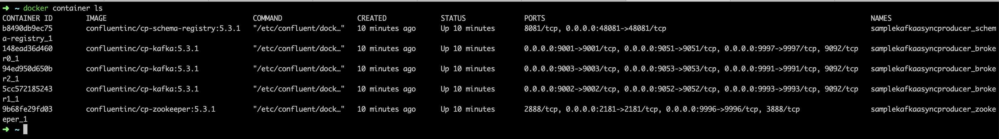

# Sample Spring Kafka Async Producer
Sample Spring Kafka Async Producer Test


##Pre-requisites to run the test
1. You should have docker (docker 2.3 or above) installed on your machine

2. You should Spin up the Kafka cluster using docker-compose file in this repo

##How to run this app?

Step 1: Clone this repo at  https://github.com/rajeshhereforyou/SampleKafkaAsyncProducer.git


Step 2: Once you have cloned this repo, you should see a file named 'docker-compose.yml' in 'SampleKafkaAsyncProducer'.

Step 3: Now, change the directory using 'cd' command 

```
cd SampleKafkaAsyncProducer
```

Step 4: Run the below command to spin up kafka cluster on your machine

```
docker-compose up
```

Step 5: Now you should see lots of logs message on the console and should stop with a last message 
```
INFO Server started, listening for requests... (io.confluent.kafka.schemaregistry.rest.SchemaRegistryMain)
```

Step 6: Once you see this message, please run the below command to make sure all the components of your kafka cluster are up and running.
```
docker container ls
```

Step 7: This command should output something like below and you are all set to run the test

 

Step 8: Now you can run the async producer test 'SampleKafkaAsyncProducer/src/test/java/com/example/async/producer/KafkaAsyncProducerTest.java'

